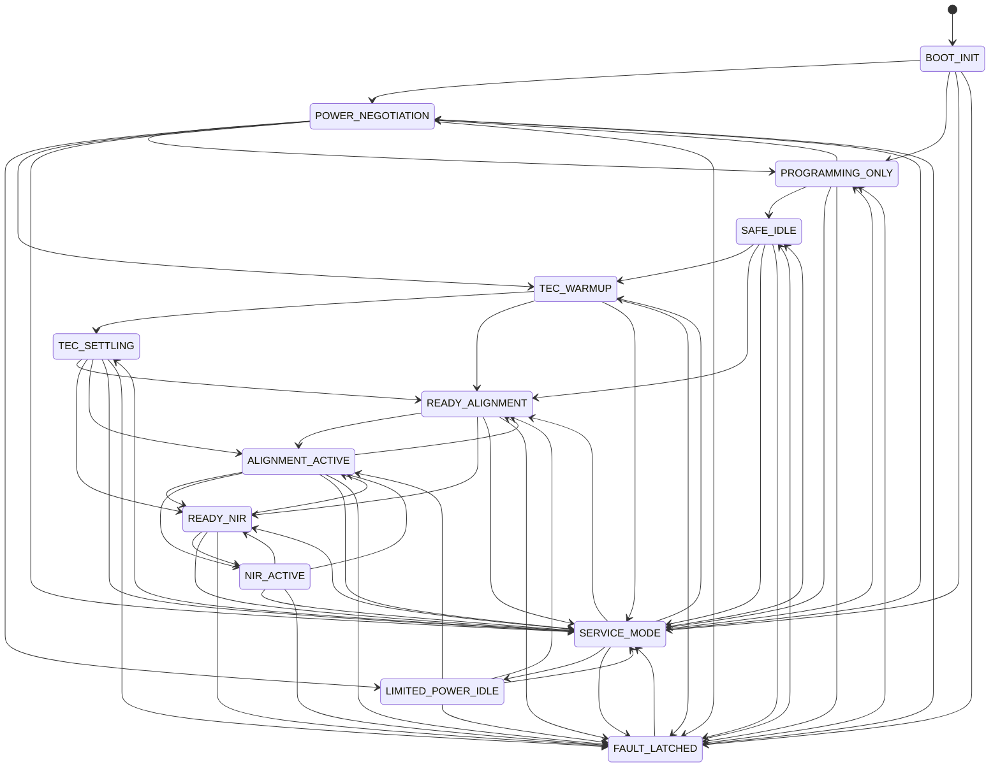

# BSL Surgical Laser Controller Firmware

This repository is the safety-first firmware scaffold for an ESP32-S3-based 785 nm handheld surgical laser controller.

## Safety Status

This tree is intentionally safe-by-default and intentionally incomplete for patient use.

- NIR emission is blocked by default.
- Green alignment is blocked by default.
- The default config is intentionally invalid until manufacturing calibration is provisioned.
- The board layer is still a mock/stub, not real hardware I/O.

Do not treat the current repository as clinically deployable firmware. Treat it as an auditable bootstrap that preserves the right safety shape while real drivers, calibration tooling, bench validation, and reaction-time measurements are added.

The bench image now also includes a Wi‑Fi SoftAP + WebSocket bridge so the host console can stay connected while USB-C is dedicated to the PD power source. That wireless bridge is a bench transport only; it does not change firmware safety ownership and it does not replace USB-based flashing or recovery. Wi‑Fi is intentionally the primary wireless path here; BLE is not the preferred browser transport for this bench because telemetry stability matters more than pairing convenience.

## Design Priorities

1. Any ambiguity means laser off.
2. The fast beam permission path is explicit and centralized.
3. State, fault, and power behavior are auditable in code and logs.
4. No dynamic allocation occurs after startup.
5. Conservative operation beats convenience or feature count.

## Current Repository Layout

```text
.
├── AGENT.md
├── CMakeLists.txt
├── README.md
├── host-console/
│   ├── README.md
│   ├── package.json
│   └── src/
│       ├── App.tsx
│       ├── components/
│       ├── hooks/
│       └── lib/
├── components/
│   └── laser_controller/
│       ├── CMakeLists.txt
│       ├── include/
│       │   ├── laser_controller_app.h
│       │   ├── laser_controller_bench.h
│       │   ├── laser_controller_board.h
│       │   ├── laser_controller_config.h
│       │   ├── laser_controller_comms.h
│       │   ├── laser_controller_faults.h
│       │   ├── laser_controller_logger.h
│       │   ├── laser_controller_service.h
│       │   ├── laser_controller_safety.h
│       │   ├── laser_controller_state.h
│       │   └── laser_controller_types.h
│       └── src/
│           ├── laser_controller_app.c
│           ├── laser_controller_bench.c
│           ├── laser_controller_board.c
│           ├── laser_controller_comms.c
│           ├── laser_controller_config.c
│           ├── laser_controller_faults.c
│           ├── laser_controller_logger.c
│           ├── laser_controller_service.c
│           ├── laser_controller_safety.c
│           └── laser_controller_state.c
├── docs/
│   ├── firmware-architecture.md
│   ├── protocol-spec.md
│   └── validation-plan.md
└── main/
    ├── CMakeLists.txt
    └── app_main.c
```

## Safety Ownership

The authoritative beam-permission decision lives in `laser_controller_safety_evaluate()` in [laser_controller_safety.c](/Users/zz4/BSL/BSL-Laser/components/laser_controller/src/laser_controller_safety.c).

That function decides:

- whether alignment is permitted
- whether NIR is permitted
- whether the horizon interlock is blocking
- whether the distance interlock is blocking
- whether a new fault must be raised
- whether the driver must remain in standby

The app layer in [laser_controller_app.c](/Users/zz4/BSL/BSL-Laser/components/laser_controller/src/laser_controller_app.c) is responsible for:

- power-tier classification
- latching non-auto-clear faults
- driving safe board outputs
- maintaining the explicit top-level state machine
- periodic control-loop scheduling
- logging transitions and fault activity

## State Machine



## Build And Bench Bring-Up

The scaffold targets ESP-IDF and plain C.

Validated local toolchain on March 31, 2026:

1. ESP-IDF `v6.0`
2. target `esp32s3`
3. observed USB port `/dev/cu.usbmodem4101`
4. observed USB identity `303A:1001 USB JTAG/serial debug unit`

Bench workflow:

```bash
. /Users/zz4/esp-idf-v6.0/export.sh
idf.py set-target esp32s3
idf.py build
idf.py -p /dev/cu.usbmodem4101 flash
idf.py -p /dev/cu.usbmodem4101 monitor
```

Observed board behavior during bring-up:

- A clean build completes and produces a flashable image.
- At least one full flash cycle succeeded on the attached ESP32-S3.
- The board accepted `bootloader.bin`, `partition-table.bin`, and `bsl_laser_controller.bin` with verified hashes.
- The ROM identified the attached target as `ESP32-S3 (QFN56)`, revision `v0.2`, with embedded `8MB` PSRAM.
- A later reflash attempt hit an intermittent native USB auto-reset/connect failure with `No serial data received`.

If flash stalls at `Connecting...` on this board:

1. Open `idf.py -p /dev/cu.usbmodem4101 monitor`.
2. Press `Ctrl+T`, then `Ctrl+P` to request bootloader mode.
3. If the next flash still fails, use a manual hardware recovery:
   hold `BOOT`, tap `RESET`, start `idf.py -p /dev/cu.usbmodem4101 flash`, then release `BOOT` once the tool begins syncing.

Do bench flashing only with laser hardware disconnected or optically terminated until every interlock is verified.

Browser flashing note:

- The host Web Serial flasher now requires a valid embedded BSL firmware signature block inside the raw app binary.
- That signature currently verifies image compatibility and provenance for bench flashing; it is not a substitute for a production cryptographic release-signing PKI.

## Documentation

- Hardware: [hardware-recon.md](/Users/zz4/BSL/BSL-Laser/docs/hardware-recon.md)
- Firmware pin map: [firmware-pinmap.md](/Users/zz4/BSL/BSL-Laser/docs/firmware-pinmap.md)
- Peripheral programming notes: [datasheet-programming-notes.md](/Users/zz4/BSL/BSL-Laser/docs/datasheet-programming-notes.md)
- Architecture: [firmware-architecture.md](/Users/zz4/BSL/BSL-Laser/docs/firmware-architecture.md)
- Protocol: [protocol-spec.md](/Users/zz4/BSL/BSL-Laser/docs/protocol-spec.md)
- Validation: [validation-plan.md](/Users/zz4/BSL/BSL-Laser/docs/validation-plan.md)

The host console bring-up flow now uses a module navigator rather than one long mixed debug page. IMU, DAC, haptic, ToF, PD, buttons, laser-driver, TEC, and generic bus diagnostics each have their own page, and the current bench firmware mirrors the richer DAC, IMU, ToF, and DRV2605 service tuning fields in the live `bringup.tuning` snapshot.
- Host console architecture: [host-console-architecture.md](/Users/zz4/BSL/BSL-Laser/docs/host-console-architecture.md)
- Next-agent guidance: [AGENT.md](/Users/zz4/BSL/BSL-Laser/AGENT.md)

## Host Console

The desktop monitoring UI lives in [host-console](/Users/zz4/BSL/BSL-Laser/host-console).

Fastest local launch on macOS:

```bash
/Users/zz4/BSL/BSL-Laser/start-host-console.command
```

The refactored GUI now includes:

- a compact bench-console layout with clearer connection guidance
- a darker operator theme with larger, higher-contrast status indicators
- a dedicated `Control` page for laser power, auto-follow setpoint staging, TEC temperature or wavelength targeting, and PCN modulation setup
- a dedicated `Bring-up` page for module presence profiles and staged DAC/IMU/ToF/DRV2605 tuning, with the low-level Bus Lab merged into its `Service` landing page
- a richer event viewer with module-aware filters and decoded I2C/SPI activity
- a firmware page with a board-aware visual guide for the ESP32-S3 `RST` and `BOOT` buttons plus raw app-binary browser flashing over Web Serial
- live power estimates for laser input, TEC input, cooling power, and total wall draw
- host-local bring-up draft persistence so partially populated bench builds can be repeated consistently

The firmware command endpoint now matches that GUI surface for the current bench image:

- the control page stages laser current, TEC target, modulation, alignment, NIR intent, and runtime safety policy through a service-gated bench state
- the bring-up page stages module expectations, tuning values, and I2C/SPI debug actions through a protected service profile
- `status_snapshot` telemetry now includes `bench`, `safety`, and `bringup` sections so the host can render live staged state without guessing

## Current Limitations

- No real board pinmap or hardware drivers exist yet.
- The confirmed firmware pin designation now lives in [laser_controller_pinmap.h](/Users/zz4/BSL/BSL-Laser/components/laser_controller/include/laser_controller_pinmap.h), but the board layer still needs real GPIO/I2C/SPI/ADC implementation.
- No real DAC, STUSB4500, LSM6DSO, ToF, DRV2605, or TEC-controller hardware transactions are implemented yet; current service-mode register tools are mock-backed.
- The service-only bring-up protocol and the host GUI can now stage module expectations, control targets, and mock register exercises without tripping the normal beam-permission path.
- No NVS persistence or CRC storage path exists yet.
- No measured reaction-time data exists yet because this environment has no hardware bench.
- The host console exists in [host-console](/Users/zz4/BSL/BSL-Laser/host-console), and browser flashing now supports raw local app binaries only. Use the CLI for first-program, bootloader, partition-table, or recovery flashing.
- The firmware now emits host-compatible newline-delimited JSON `status_snapshot` and `log` events for both the control and bring-up pages, but the actuator/sensor values are still scaffold values from the mock board layer.
- The Sensor & LED board source files are still missing, so ToF and two-stage trigger wiring are not yet source-backed.

Those omissions are intentional. The current goal is to lock the safety architecture and handoff structure before anyone starts landing risky hardware code.
